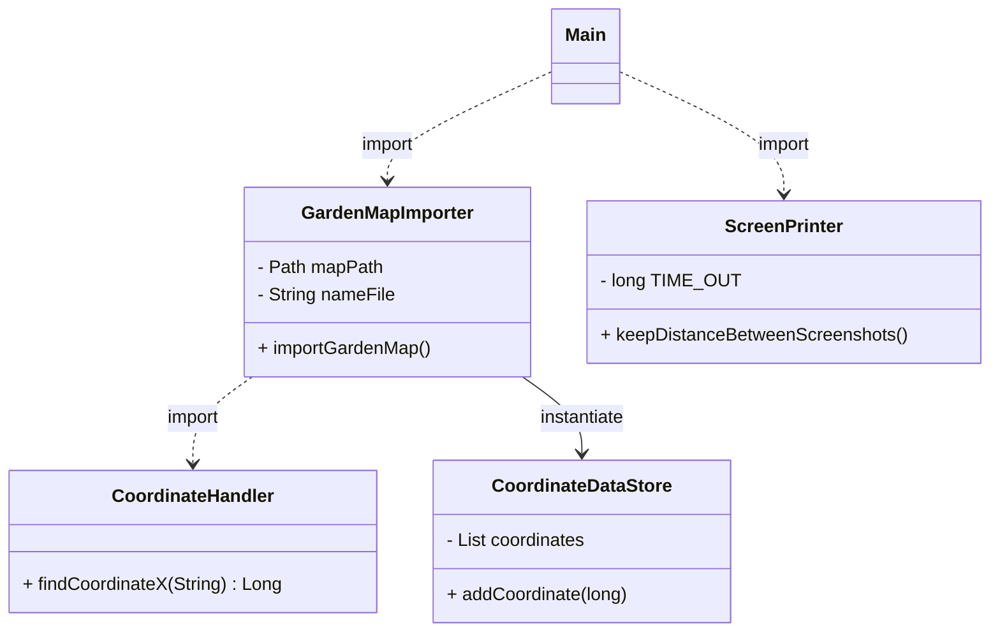
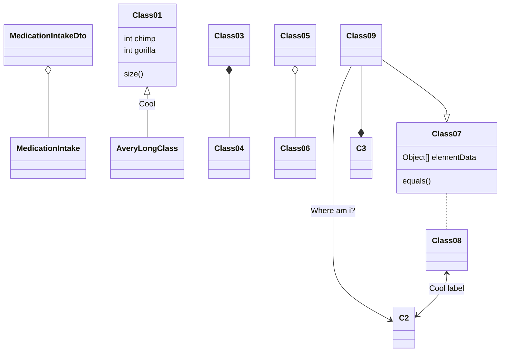

# UML
    Not finished diagram !!!!!!
IntelliJ IDEA properties to appear the diagram:  
settings / Languages&Frameworks / Markdown / Markdown extensions; check/install Mermaid

# (UML markers - training)

