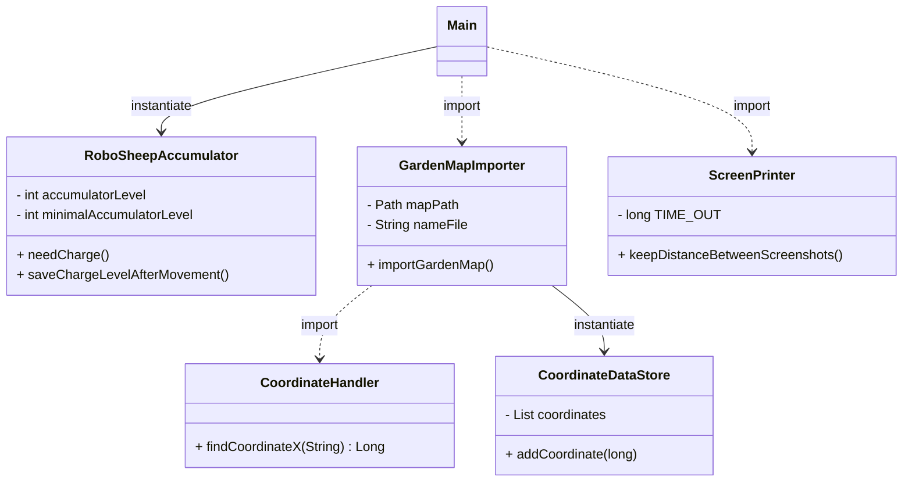

# UML
    Not finished diagram !!!!!!
IntelliJ IDEA properties to appear the diagram:  
settings / Languages&Frameworks / Markdown / Markdown extensions; check/install Mermaid

#Coordinates conversion

|     | 1         | 2         |
|-----|-----------|-----------|
| 1   | 1 000 001 | 1 000 002 |
| 2   | 2 000 001 | 2 000 002 |
| 3   | 3 000 001 | 3 000 002 |
